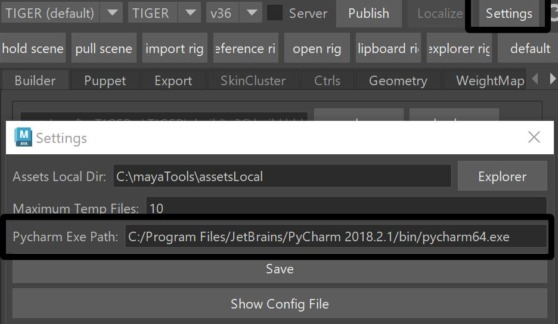
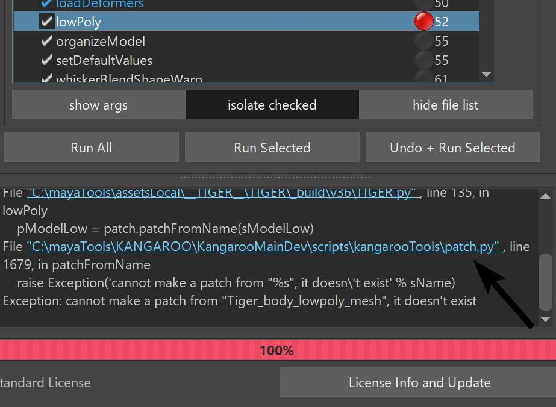
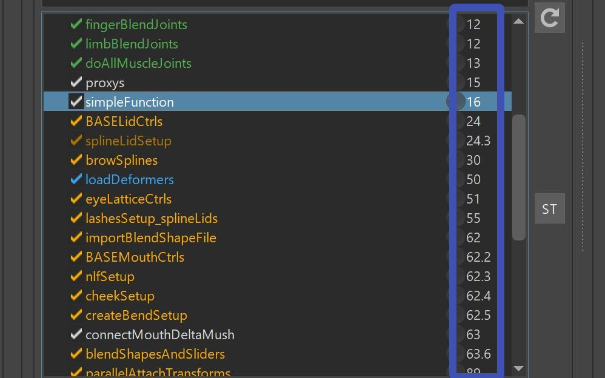

As you remember from the builder documentations, everything is written in Python. And we can customize a lot

# PyCharm
If you have pycharm installed, there's lots of quick ways to jump to a specific code.  
But for that we have to link it first.  
On the settings, 


And then you can go to any function to the builder and with right click quickly jump to the code.  


Same thing happens on Errors in the Kangaroo Log - those are links you can just click on 



# Simple way of adding function
The simplest way to add a function is just in the character script. Basically the python file that is 
inside your version folder.  
It's the file that is shown in *white*

In there add a function that looks like this:
```python
@builderTools.addToBuild(iOrder=16)
def simpleFunction():
    print ('hello')
```
The important thing is the decorator that starts with *@builderTools.add...*. If you don't have
that, the function won't show up in the Builder.
Do you see the iOrder=16 parameter in the code above? That's the order number where shows up in the builder. The 
numbers are listed on the right side of the *Function Table*. Basically for finding the right 
order number, just look in the table at which place you'd like it to be.



