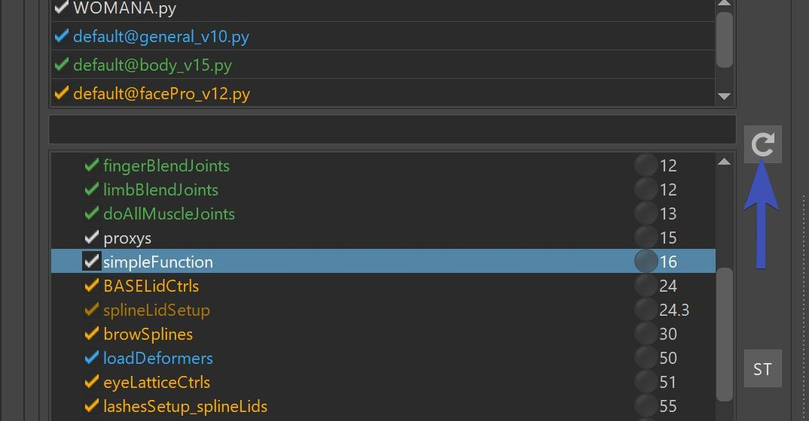
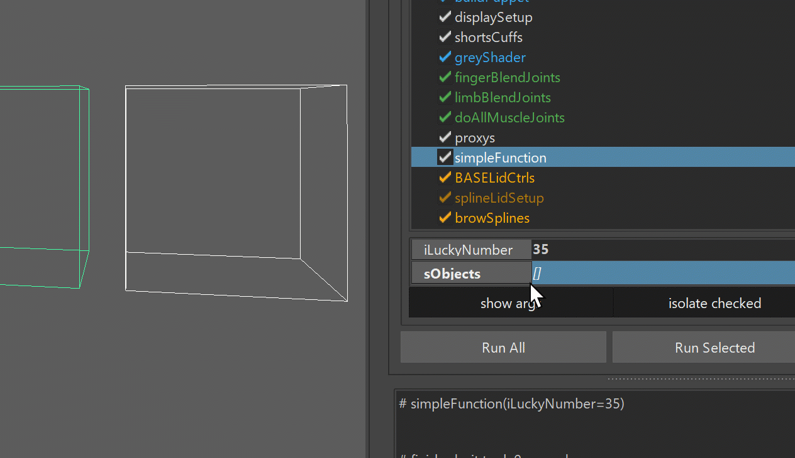
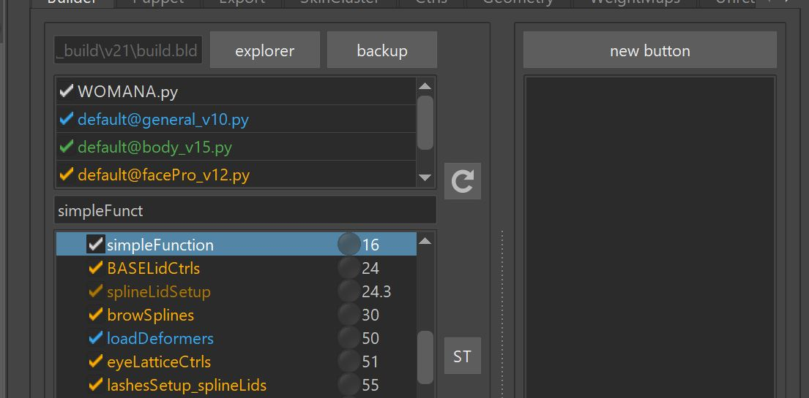
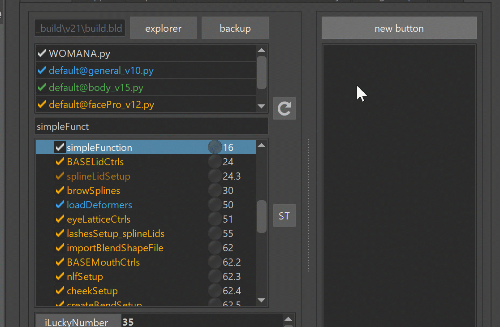
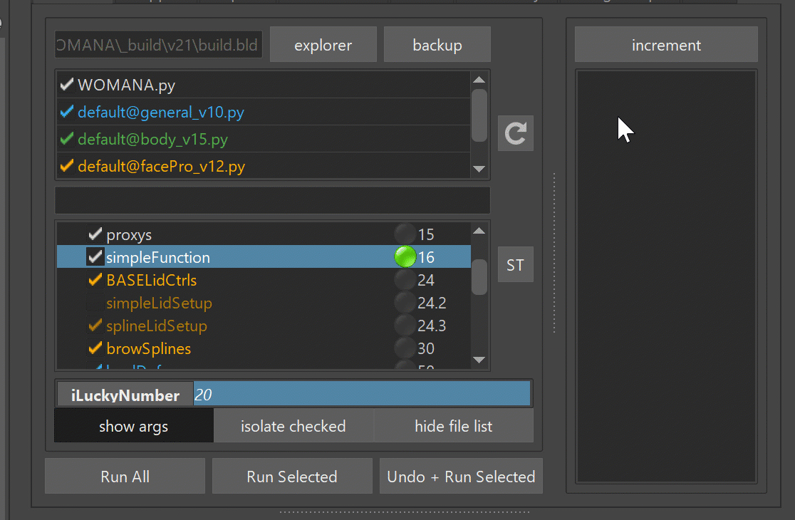
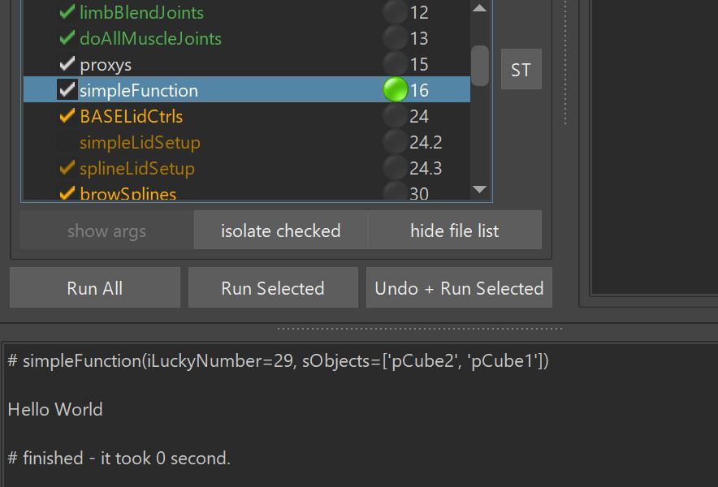
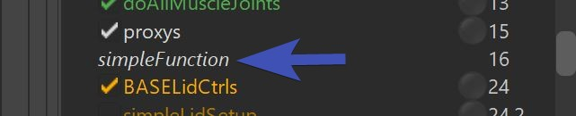
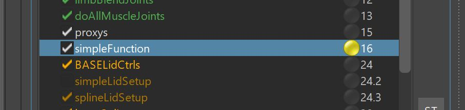
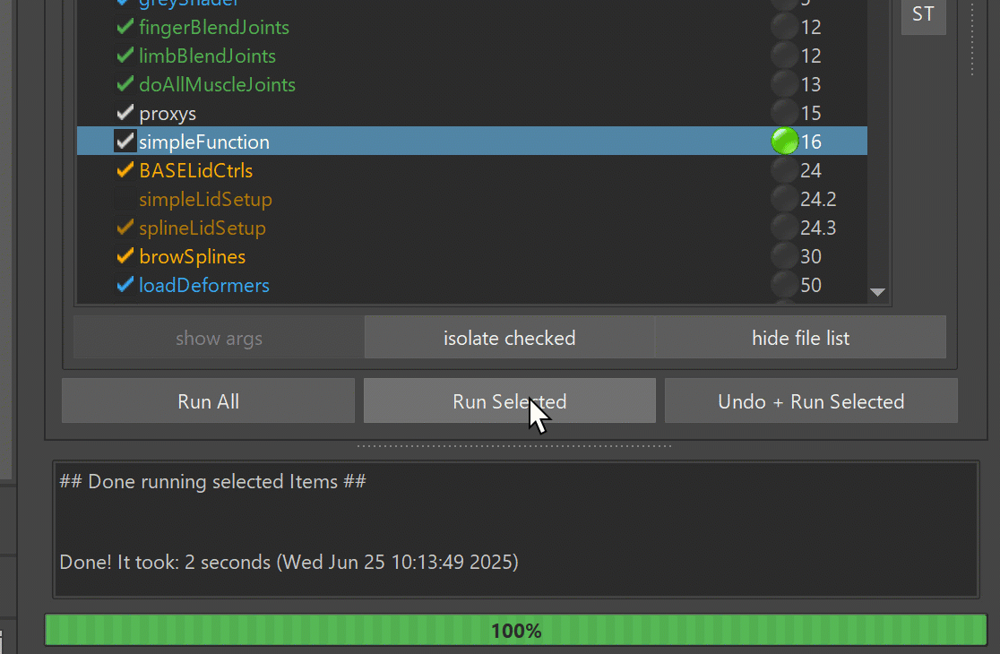
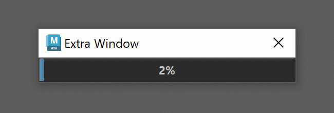

As you remember from the builder documentations, everything is written in Python. And we can customize a lot

# PyCharm
If you have pycharm installed, there's lots of quick ways to jump to a specific code.  
But for that we have to link it first.  
On the settings, 


And then you can go to any function to the builder and with right click quickly jump to the code.  


Same thing happens on Errors in the Kangaroo Log - those are links you can just click on 


# Simple way of adding a Function
The simplest way to add a function is just in the character script. Basically the python file that is 
inside your version folder.  
It's the file that is shown in *white*, and it's usually the same name ass your asset.

In there add a function that looks like this:
```python
@builderTools.addToBuild(iOrder=16)
def simpleFunction(iLuckyNumber=20, sObjects=[]):
    print ('Hello, your lucky number is %d' % iLuckyNumber)
    print ('And the objects are: %s' % sObjects)
```

And then to get that into the builder, you need to click the reload button. Basically every time you change
any of the scripts, the builder will only know about it if you click that button. Unless you switch to the
character with the upper comboboxes, then he'll reload anyway


Now let's look at the function. The important thing is the decorator that starts with *@builderTools.add...*. 
If you don't have that, the function won't show up in the Builder.
Do you see the **iOrder=16** parameter in the code above? That's the order number where shows up in the 
builder. The numbers are listed on the right side of the *Function Table*. Basically for finding the correct 
order number, just look in the table at which place you'd like it to be. If you want the function to run after
the *LoadDeformer()*, the priority attribute needs to be something higher than 50.


## Function Attributes
Now let's run the function with the *Run Selected* button. It should come to no surprise that when you change
the attribute in the builder, he'll print the sentence with the new number.  


## Scene Selection
Getting the scene selection into the attributes is quick. On any attribute that is declared with an empty list,
you can do the right click -> **Scene Selection** option  



## Buttons
Let's add a button. Change the above code to this.


```python
def buttonFunction():
    print ('a button was clicked')

@builderTools.addToBuild(iOrder=16, dButtons={'new button':buttonFunction})
def simpleFunction(iLuckyNumber=20, sObjects=[]):
    print ('Hello, your lucky number is %d' % iLuckyNumber)
    print ('And the objects are: %s' % sObjects)
```
After clicking the reload button, you'll get this button:



## Marking Menus
If you want marking menus into the button, you just nest a few dictionaries:


```python
def buttonA():
    print ('buttonA was clicked')

def buttonB():
    print ('buttonB was clicked')

def buttonC():
    print ('buttonC was clicked')

@builderTools.addToBuild(iOrder=16, dButtons={'new button':{'buttonA': buttonA, 'more buttons': {'buttonB':buttonB, 'buttonC':buttonC}}})
def simpleFunction():
    pass
```


Clicking the reload button with this new code, you'll that that super cool looking marking menu. You can even
extract the function with that **<-->** button, which can be very handy if the menu gets complex.




## Let the Button change your Attributes
```python
def incrementNumber(iLuckyNumber, _uiArgs={}):
    print ('Lucky number is %d' % iLuckyNumber)
    iLuckyNumber += 1
    _uiArgs['iLuckyNumber'].setText(str(iLuckyNumber))

@builderTools.addToBuild(iOrder=16, dButtons={'increment':incrementNumber})
def simpleFunction(iLuckyNumber=20):
    print ('Hello, your lucky number is %d' % iLuckyNumber)
```

See how the button changes the attribute's value? This is basically what all those *fill* buttons in kangaroo
are doing:



## Logging
While you might be happy enough with the print() function, sometimes it's cool if you can
also log into the Kangaroo Log field at the bottom.

```python
import kangarooTools.report as report
report.report.addLogText('Hello World')
```
There's just one little catch. You'll have to deselect the function and select it again.
*Why?*
Because after he finishes running, the log shows a generalized report how the whole thing did etc.  
The *report.addLogText()* is more useful for example after you run've the whole thing and you want to go back
to the functions and check their logs. You can imagine it'd be a nightmare if in those cases you would have
just used the print() function.



## Just Buttons
Sometimes you just want to add a few buttons but no function to run in the builder.
```python
def buttonA():
    print ('buttonA was clicked')

@builderTools.addToBuild(iOrder=16, bNoCheckbox=True, dButtons={'buttonA':buttonA})
def simpleFunction():
    pass
```

The function then looses its checkbox and gets an italic font.



## Yellow Lights
By default the lights are always green if the function finished running and red when it errored.
But sometimes you want to signal to the user that even though it didn't error, it wasn't quite without problems.
To do that, simply *return False*.
``` python
return False
```
And then you get that yellow light:



## Progress Bar
Making use of the progressbar at the bottom is easy.

Just run this code:
```python
    import kangarooTools.report as report
    import time
    iCount = 100
    report.report.resetProgress(iCount)
    for i in range(iCount):
        report.report.incrementProgress()
        time.sleep(0.03)
```

## Progress Bar Window
You can also have this little window you've probably seen on some other tools.
  
It involes a bit more code though.
And it's best to put some of it into a *try* block, because otherwise you'll have that annoying window left if your code
errors
```python
    import kangarooTools.utilsQt as utilsQt
    import time
    iCount = 100
    qStatusWindow = utilsQt.QStatusWindow('Extra Window')
    try:
        qStatusWindow.setCount(iCount)
        for i in range(iCount):
            qStatusWindow.increment()
            time.sleep(0.03)
    except:
        raise
    finally:
        qStatusWindow.end()
```

## Getting Asset Info
Here are some functions for getting the Current Assets
```python
import kangarooTools.assets as assets
assets.getCurrentAsset() # returns the current asset name
assets.getCurrentProject() # returns the current project name
assets.getCurrentVersionPath() # returns the absolute version folder inside the *_build* folder

```


# Extra Builds
So far we've just learned how to add some fun python stuff to your character file. But what if you want to make a company wide tool
that other people can run, too - so everyone can just add the file at the top as shown in this gif:

This is where extrabuilds come in.

First we'll have to tell kangaroo with the Environment Variable **KANGAROO_EXTRABUILDS_PATH** a location where we have other python files
with some builds.

If you want to do that with the *pathEnv.mel* file just to get started quickly - the entry would look something like this:
```
putenv "KANGAROO_EXTRABUILDS_PATH" "myBuilds@D:/mayaTools/KANGAROO/myExtraBuilds";
```

Btw, for more than one build folder you'd just add them all with the same variable but separated with the **;** sign
```
putenv "KANGAROO_EXTRABUILDS_PATH" "myBuildsA@D:/mayaTools/KANGAROO/myExtraBuildsA; myBuildsB@D:/mayaTools/KANGAROO/myExtraBuildsB";
```

You could start your new build file by just copying an existing one from the *kangarooBuilds* folder and rename.

Or just start with a simple and clean file, and call it *myNewBuild_v0.py*:


```python
import kangarooTabTools.builder as builderTools
import kangarooTools.utilFunctions as utils

kBuilderColor = utils.uiColors.yellow

@builderTools.addToBuild(iOrder=16)
def simpleFunction(iLuckyNumber=20, sObjects=[]):
    print ('Hello, your lucky number is %d' % iLuckyNumber)
    print ('And the objects are: %s' % sObjects)

```

Then you can add it to the builder like shown above.


# Connecting to Studio Pipeline
If you've managed to read until here, you are ready to connect kangaroo to your studio pipeline.
## *importModel()* recreate
Create a new **Extra Builds** file as shown in previous chapter,
and add a function in there called something like *importModel2()*. In there create some code that
looks in the files of your studio pipeline and imports the correct model.
For doing that you'll most likely need the code snippets in **Getting Asset Info** for getting your current
asset infos.
You might find this function useful for importing the file, once it found it:
```python
import kangarooTools.utilFunctions as utils
utils.importMayaFiles(sFiles, sNamespace=None, bReference=False, bReturnAllNodes=False)
```
## *prepareForPublish()* recreate
*** TODO: WRITE HOW THAT WORKS ***


# Custom Limbs
Writing your own puppet limbs is where things get very advanced, therefore a decent python level is required.  
Start by creating an empy folder, and declare it with the Environment Variable **KANGAROO_EXTRALIMBS_PATH**.  
Then copy/paste one of the existing limbs from the *kangarooLimbs* folder of your Kangaroo installation in to that new folder.
Simplest one to start with is probably *singleTransform*.  

The attributes that you see in the Puppet tool on the right side are all either just the function parameters of the
*\_\_init\_\_()* function or the feature functions (*feature_fk()* in this case)

The attachers get declared with extra functions:
``` python
def generateAttachers_init(self):
    return {'root': {'sTrs':'tr', 'bMulti':False},
            'scale': {'sTrs':'s', 'bMulti':False}}
```
And then inside the feature function you can assign the actual transforms like this:
```python
dAttacherBuildData['root'] = (utils.getDagPath(self.cCtrl.sPasser), self.cCtrl)
```

The actual output joints are defined like this in the *\_\_init\_\_()* function:
```python
self.dOutputs['main'] = None
```
Basically in this case you can see that singleTransform limb only has one output.
Then on the return, the first one (*fks* variable in this case) is a list of joints, and needs to be the same length as
how many outputs you declared above
```python
return fks, cReturnCtrls, dAttacherBuildData
```

