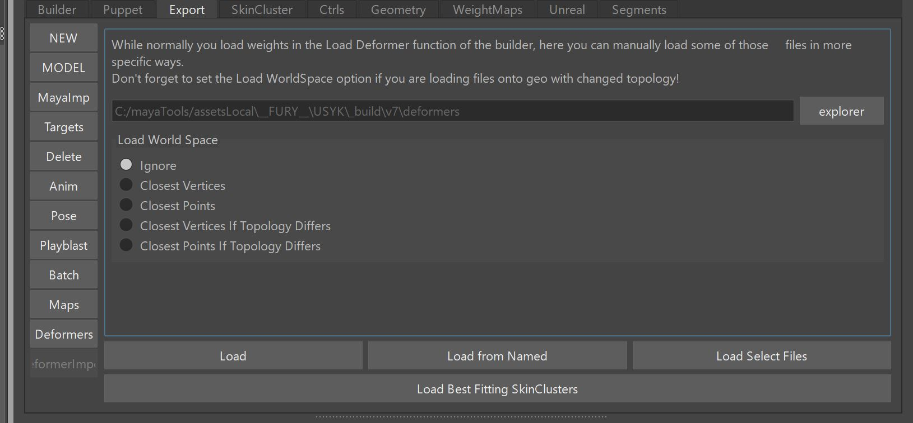
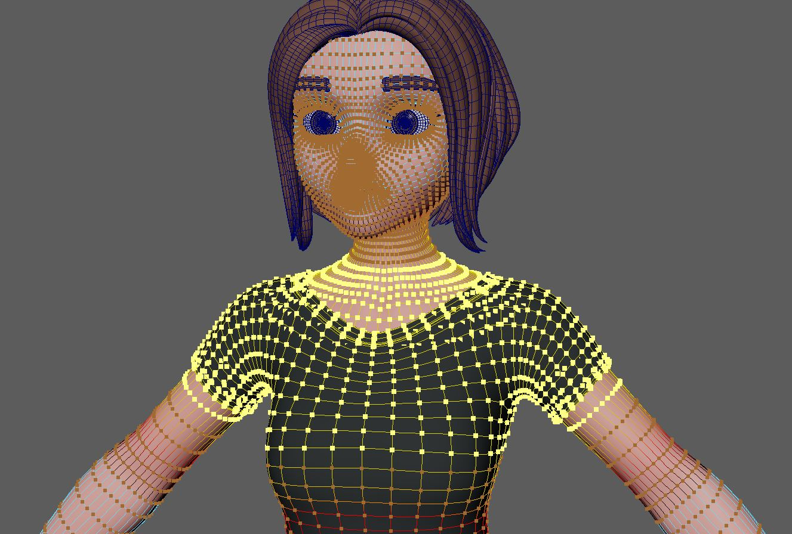
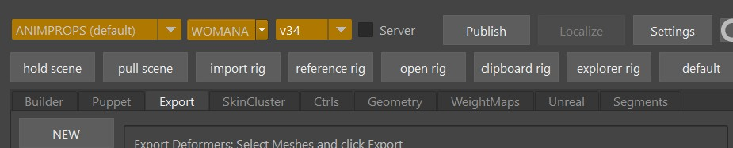

With the *Deformer Import* tool you can do the same thing as what the *loadDeformer()* function does but with a few more options.

The purpose of this tool is to fix some deformers if:  

- models changed, or
- you like the weights on a certain part of the mesh more in a previous version

!!! warning "Only SkinClusters"
    This does only the standard skinClusters. It will not work on other deformers such as deltamush or post skinClusters with suffixes.
     

## When to NOT use it
### Simple Mesh Changes
When the mesh names changed, very often you can just rename the *.wts* files inside the *deformers* folder. 
They all have the same naming convention (*TYPE__MESHNAME.wts* or *TYPE__MESHNAME__SUFFIX.wts*).   

Those file names basically consist of 2 or 3 parts, separated by double underscores (\_\_). And the second part is the mesh name.  
So for example if the mesh got changed from *body_geo* to *torso_geo*, the file *deltaMush__body_geo__MOUTH.npz* needs to be changed to
*deltaMush__torso_geo__MOUTH.npz*

!!! warning "Watch Out for Underscores!"
    Don't confuse the double underscore (\_\_) with the single underscore (\_). They might look the same at first glance, but 
    mixing them up can lead to very bad troubles.

### Simple Topology Changes
If the topolgoy changed, and you have set the **bWorldSpaceIfNotMatching** attribute set to *True* in the 
*loadDeformer()* function, it'll load things automatically by worldspace. This works because all the *.wts* files contain
information about the mesh.
!!! tip
    You can also leave this attribute at *True*. It'll only do worldSpace transfer if the topology changed. 
    In older Kangaroo versions it was inconvenient to leave it as *True*, because it was easy to overlook the model change.
    But in the latest version on some situations (like the *newScene()* function or puppet *clean* button) it'll remind you 
    that it transferred the weights by asking you if you want to save the weights.

## Load 

For whatever meshes you have selected it'll search for the files and loads them.  
Sounds simple but the real power is that it supports vertex (soft) selection.   

So you could select vertices across different meshes:  
   

Maybe even switch to an older version where you liked the weights more (note how it turning red means you are not on
current version):  
   

And click the **Load** button.

## Load best fitting skinClusters
This button is great for when your character has many meshes, and modellers decided to just blindly rename a lot of meshes.

