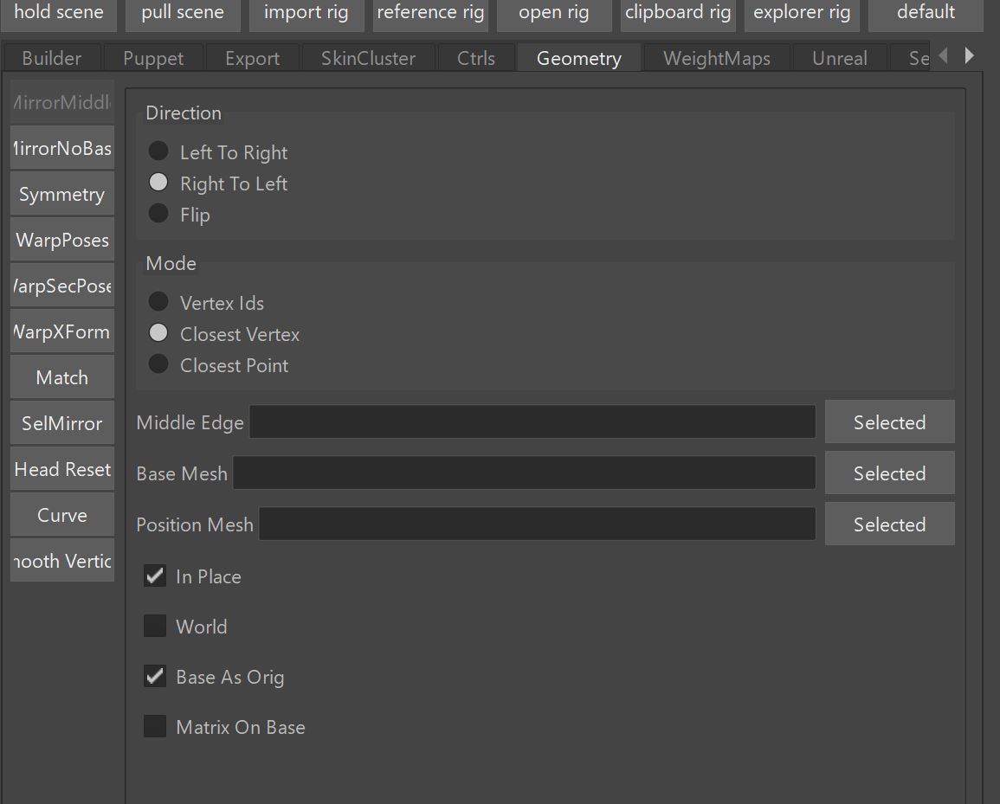
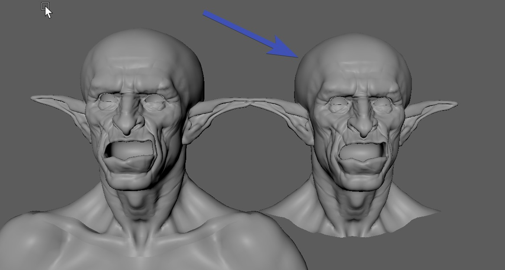

  

## Mirror

!!! info "Video"
    The Mirror is shown in the first part of the [Video](https://www.youtube.com/watch?v=0ZUVseX12dQ)

While the video already gives you a good intro in how to use them, here's a few extra features that got added after
creating the video:

Mirror Middle now has the checkbox **Matrix on Base** that mirrors the vertices local to the vertex matrices. 
This gives better results when mirroring poses where the basemesh is unsymmetrical.

On MirrorMiddle additionally to **Closest Vertex** you now also have **Closest Point**, which is useful when the 
topology of your mesh is unsymmetrical

 
 
## Create Symmetry Mesh
!!! info "Video"
    Creating symmetry mesh is explained [here](https://www.youtube.com/watch?v=0ZUVseX12dQ&t=2m10s)
    
    
   
## Match Vertex Positions
Very simple but extremely seful tool to just match some vertices to another mesh.
!!! info "Video"
    See it in action [here](https://www.youtube.com/watch?v=0ZUVseX12dQ&t=2m53s)

## Warp Poses
This is for when we have a model change and you have some sculpted poses.

If you are using *Shape Editor* or *Pose Editor*, the warping is tied into there. But if you have meshes outside
of those tools, you can use this tool to warp them.

!!! info "Video"
    See how it works in this [video (Model Change)](https://www.youtube.com/watch?v=3V0RUjhqewY&t=7m14s).  
    For the options, the video recommends *matrix*, but lately is has shown that most of the time **Wrap Deformer** 
    is the best option, even if topology is the same.  
    **The first part of this video is outdated!**. We now use the Pose Editor instead of those python functions.

## Warp Secondary Poses 
This is for warping poses to secondary meshes

If you are using *Shape Editor* or *Pose Editor*, the warping is tied into there. But if you have meshes outside
of those tools, you can use this tool to warp them.

!!! info "Video"
    See how it works in this [video](https://www.youtube.com/watch?v=3V0RUjhqewY&t=6m45s).   
    **The first part of this video is outdated!**. We now use the Pose Editor instead of those python functions.

## Head Reset
This tool reorders the vertices so all the head ones start from 0. We do this so that
facial blendShapes can be sculpted on a smaller mesh that doesn't include the body.
Apart from resetting the vertex count, it also creates this extra head geo that has the same vertex order as the new 
geo:  
  

Select the head faces, and click **Head Reset selected Faces**. This will create   
a new mesh with suffix *_HEAD* and recreates the old one so it has the matching vertex count with the head one.
From now on you can use the HEAD one for sculpting.

## Smooth Vertices
This relaxes the vertices. It's similar to the smooth sculpting tool, but works just on vertex (soft) selection. It's very useful
for when sculpting Correctives and you want to relax some faces that are collapsed from a pose.

## Curve
Here you can slide or move perpendicular some vertices along a curve. It can be useful for sculpting some expressions 
on a very curved mouth

 
## Warp XForms
This warps xforms between 2 meshes. 
You have an option to do *blueprint ctrls* for the **Blueprint Rig**.
So you can use that tool if the proportions changed but topology is the same, or if you are setting up a new character
that has same topology but different proportions.
!!! video
    There's a short video on LinkedIn that demonstrates it:  
    <a href="https://www.linkedin.com/posts/thomas-bittner-6bb6302_this-is-the-tool-i-use-for-warping-guide-activity-7221427670796910594-lcWI?utm_source=share&utm_medium=member_desktop&rcm=ACoAAABy3u8BK03tH_Bovh-T4-W99NGXldU3f_g" 
    target="_blank">LinkedIn Post on warpXForms</a>

