Plane Cutter is a tool that can get you quick first pass **SkinCluster** or **Proxy Geometries**

<video autoplay muted loop controls width="1266">
    <source src="../../images/planeCutter_selectedPolysAllPlanes.mp4" type="video/mp4">
    Your browser does not support the video tag.
</video>

!!! info "Video"
    While this document explains it all - if you find it simpler to follow in a video, click [here](https://www.youtube.com/embed/sQqQVCS2vWY){target="_blank"}


!!! info "LinkedIn"
    If you are curious what people say on LinkedIn about this: 
    <a href="https://www.linkedin.com/posts/thomas-bittner-6bb6302_this-tool-generates-a-skincluster-from-nurbs-activity-7216376145527644160-BsOr?utm_source=share&utm_medium=member_desktop&rcm=ACoAAABy3u8BK03tH_Bovh-T4-W99NGXldU3f_g" 
    target="_blank">LinkedIn Post</a>


## How does it work??
Before we create the planes, let's have a look at a finished example. In the following image you can see how the planes are
ordered in a hierarchy:  
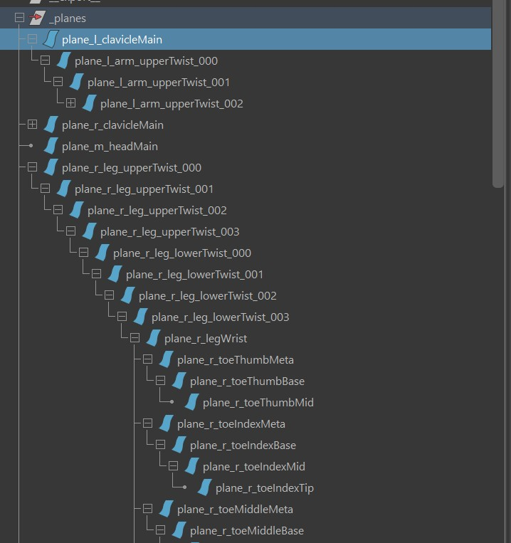    
And the hierarchy is not the same as the joint hierarchy. One of the differences you see is that **plane_l_clavicleMain**
and **plane_m_head** are at the top of the hierarchy. This means he will cut the clavicle and head first.  
But what also matters is that he's traversing through all the planes recursively, which means that for every plane he uses to cut,
he will go through all the child planes one by one, and when all the child planes are done, he'll go back and do the sibling of the parent etc..  

Let's look at **plane_l_arm_upperTwist_000** in the following picture. The plane is a bit small, but you'll see the blue arrow 
pointing to it. I've marked in yellow the part that this plane is considering. Which is the part that its parent   
(*plane_l_clavicleMain*) was cutting out already. And in red I've marked the part that this plane is actually cutting out:  
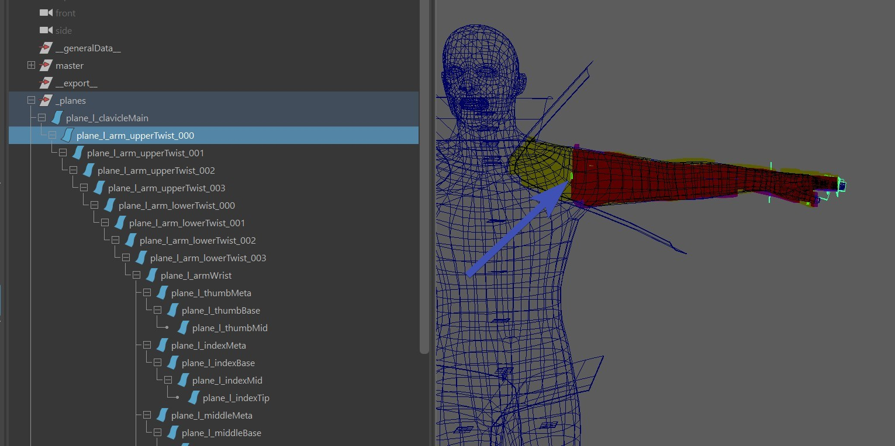    

Now it gets interesting when we get to the fingers. When we are cutting the **plane_l_thumbMeta**
(which is where the blue arrow is pointing to), we are only considering the part that I've marked in yellow, again because that is 
what the parent plane before (**plane_l_armWrist**) was cutting out. And the part that I'ved marked in dark red is what this plane
is actually cutting out:  
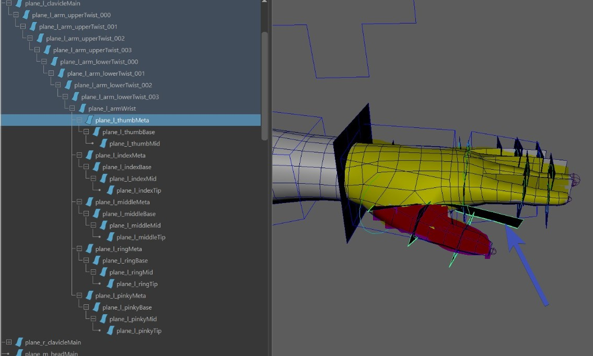    

After the clavicles (and the children such as arms, and wrist, and fingers...), he'll do the head. And guess what - for cutting the head, he'll only
consider everything that was NOT cut yet by the previous planes, which is what I marked in yellow in the following image.
And again red is that part that this plane is cutting:  
    

And this the upper leg comes after the head:  
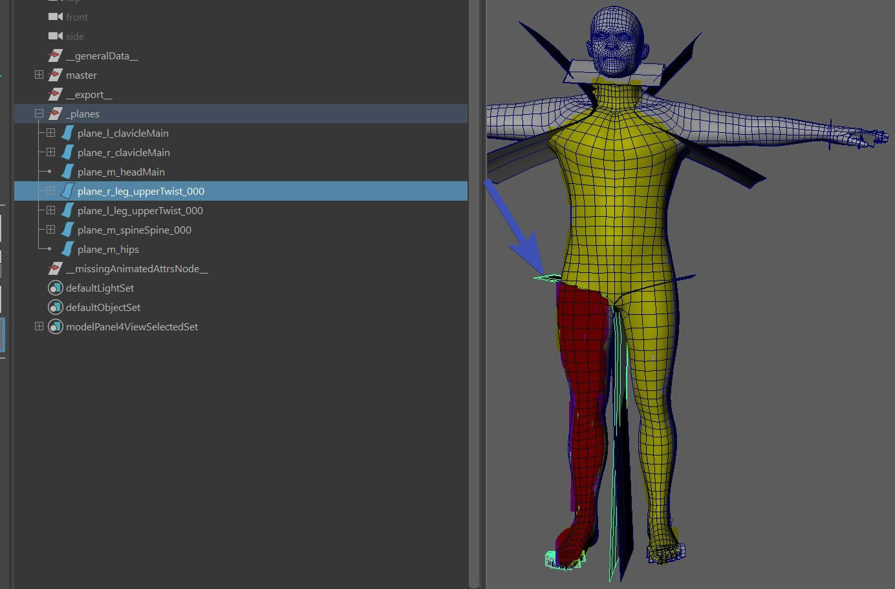    


## Order of the Siblings
So far we've mainly talked the order is that it goes to the children first etc. But underneath the siblings, which ones will
he do first?  
This is determined by the **priority** attribute, each plane has it:  
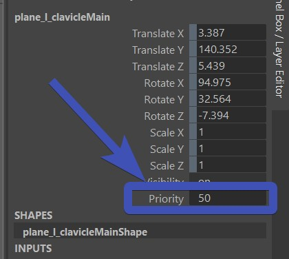    
Basically from all the siblings, the ones that have higher priority will be called first. And if a plane doesn't have siblings,
this attribute is ignored.

## Plane Influence goes into Infinity
You might have noticed already that some of the planes are very small. And that's ok in most cases, he'll sort of creates a tangent
from the edge of the planes, so their influence go into the infinity. In the following image you can see what *can happen* 
if the plane is smaller. I drew a grey line to where the influence goes, and there you can see he's grabbing some of the 
vertices that shouldn't be affected.
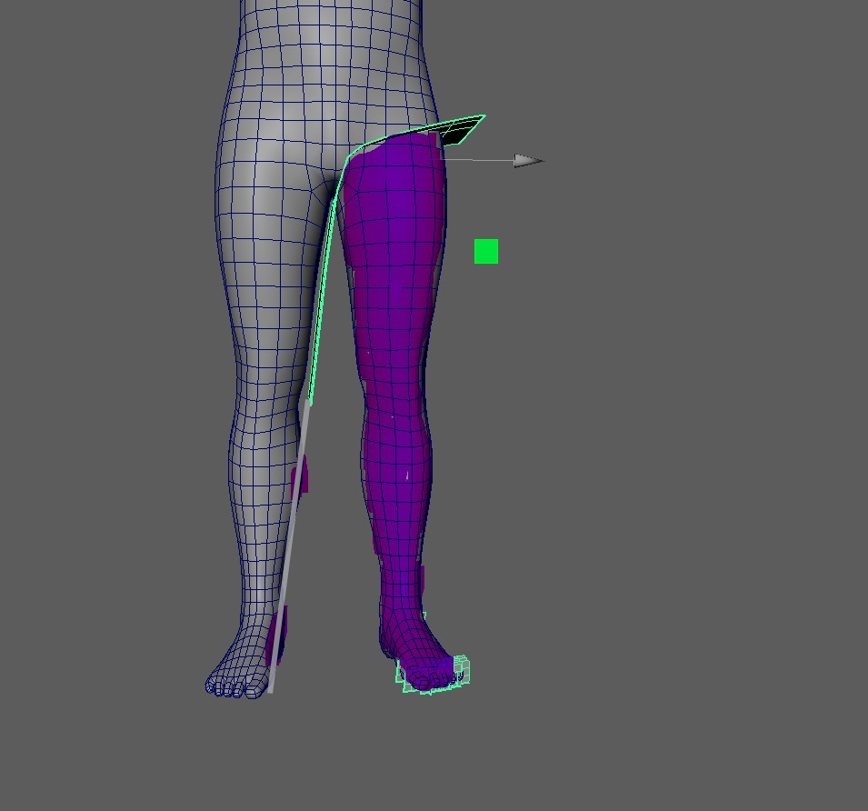    
!!! note
    This tangent/infinity is by far the most common cause for troubles. Whenever you have things not working as expected, 
    first check the tangents of all the planes.


## Create the Planes
Here we'll show how to set it up for a Biped. For quadrupeds it would be similar.

### 1. Create
After you built the character, in the **Segments** tab, under **Create**, click **Create for All Joints**:  
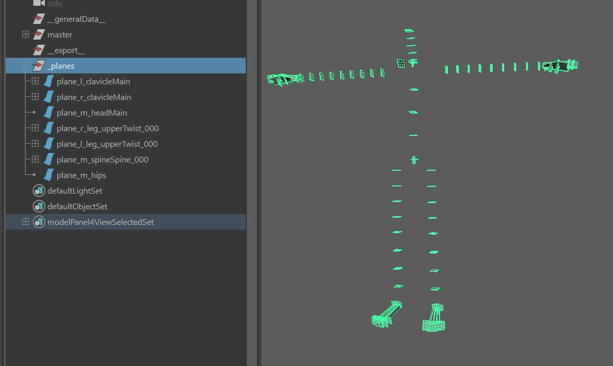    
This creates simple planes, and takes care of the hierarchy.


### 2. Shape the Clavicle
The clavice plane is one of the few that you have to sculpt. Sculpt it so it cuts off the clavicle from the body:  
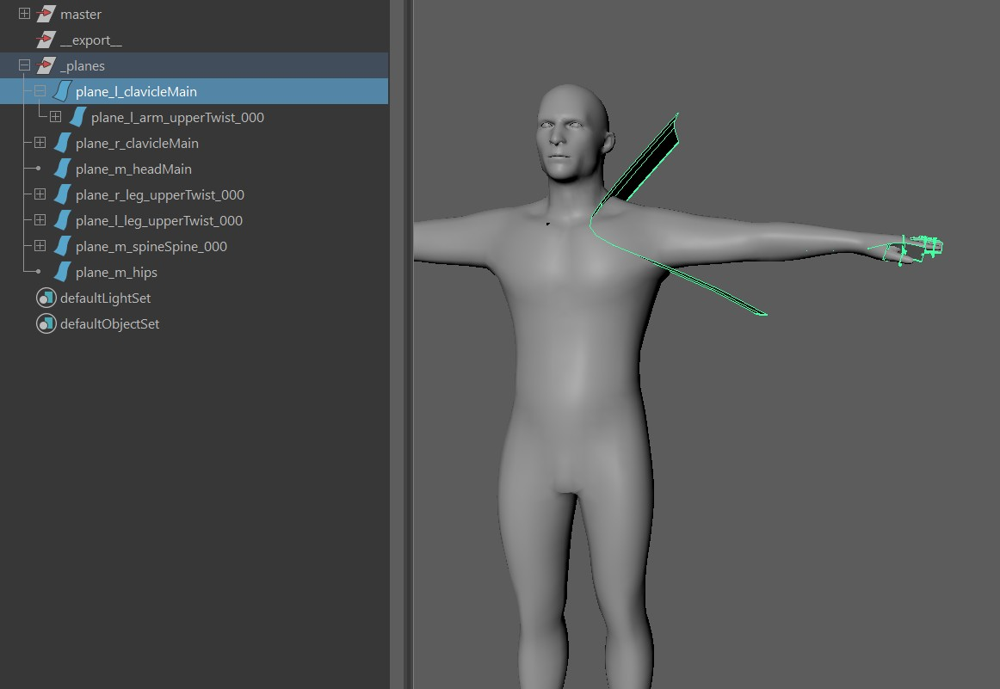    


### 3. Inspect the fingers
In this case the fingers already work well, but sometimes you might have to adjust the cvs a bit, especially when in the
model the fingers are very close to each others.  
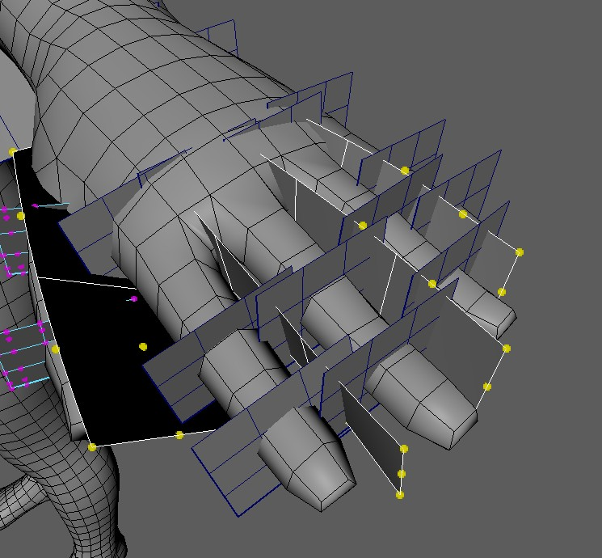      
!!! note
    Those planes between the fingers are created based on the finger joint orientations. If you see that the planes are
    aligned a bit strangely, this might be a good time to go back into the blueprints.


### 4. Shape the Upper Legs
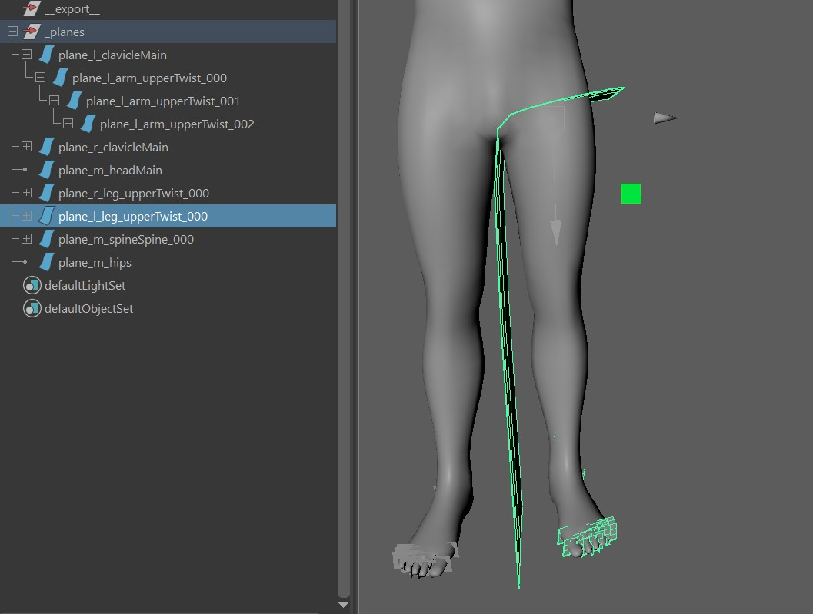        


### 5. Take care of the ankle
By default, the ankle plane (*plane_l_legWrist*) is oriented based on the joints. But that's not a good thing. In the following image, this plane
would cut the heel off the foot:  
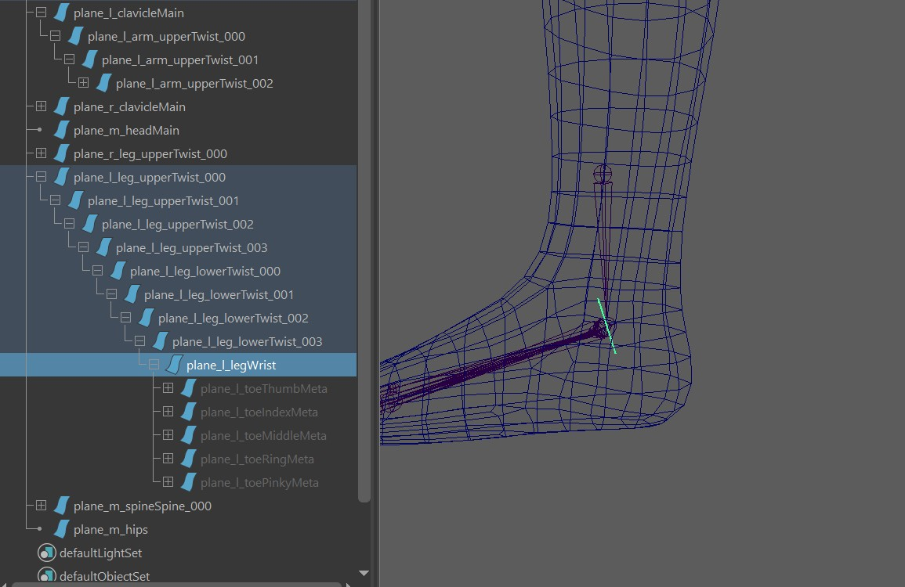  
So we need to rotate the CVs, so the plane cuts the foot as a whole:  
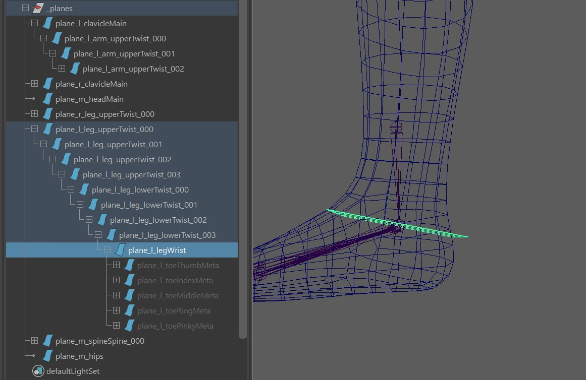  


### 6. Check the Toes
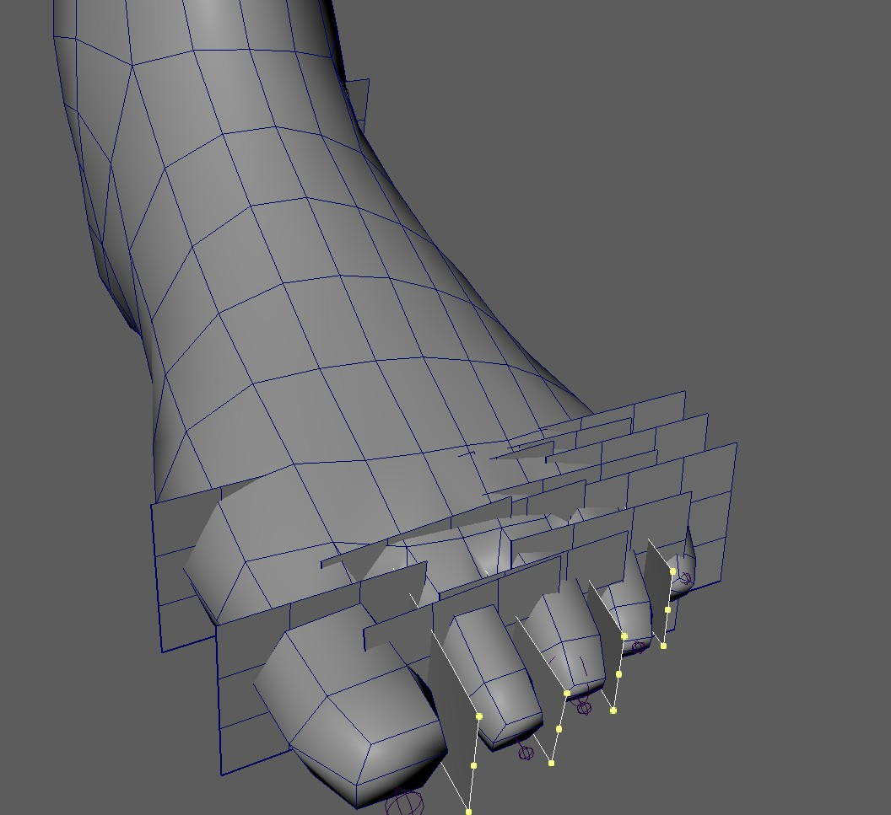  


### 7. Mirror all the planes
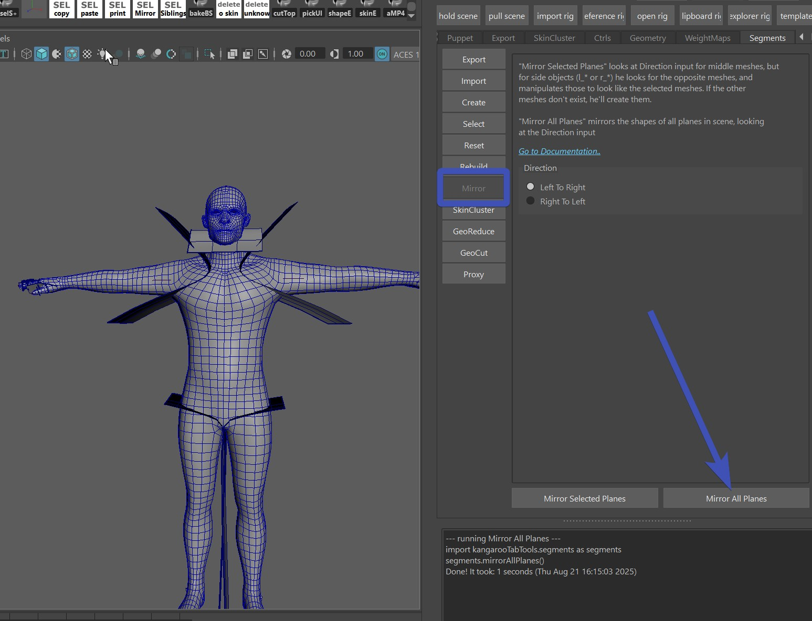    


### 8. Try it out
    
Then move around the ctrls, or apply some ROM. Is probably not perfect at the first time, so just adjust the planes, mirror, and 
click the **Selected Polys all Planes** button again.


## Getting a better Default
In the puppet tool all limbs have this **Segments Priority** attribute:   
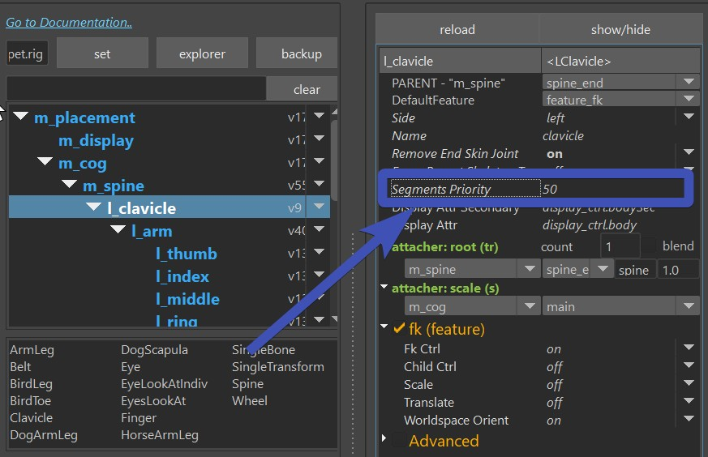    

It's a multifunctional attribute, see in the following table how to set it:

| Segments Priority |                                                                          |
|-------------------|--------------------------------------------------------------------------
| -1                | don't create planes for this limb                                        |
| 0                 | default, just put those planes under the parent limb in the puppet tool  |
| > 0               | put it at the top of the hierarchy and assign this value as the priority |


## Export Planes
The export tool just exports the *_planes* group. No need to select anything for it:   
    


## Proxy Cuts
You can also use those planes to create Proxy Cut geometry:    
    

When you've got the planes in the scene, just use the **GeoCut** tool:  
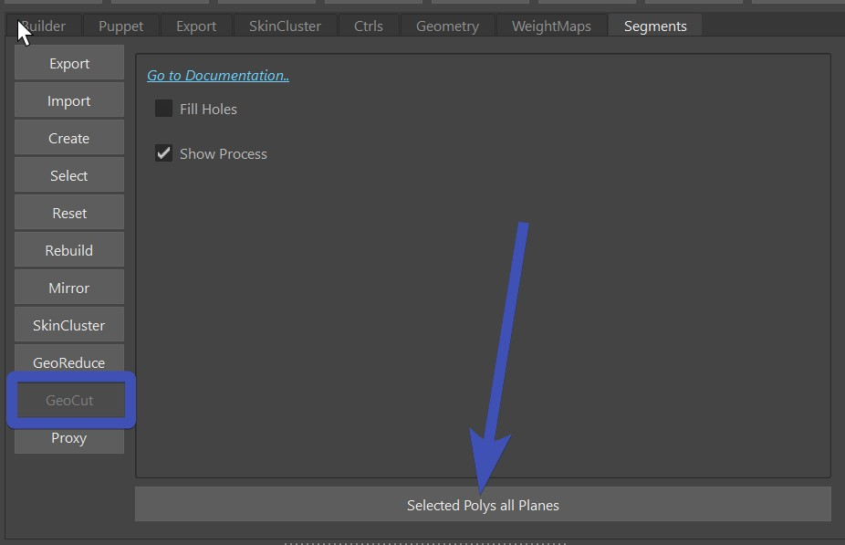    
After that you may have to use the **Proxy** tool to create proper meshes from the geos the previous tool cut:  
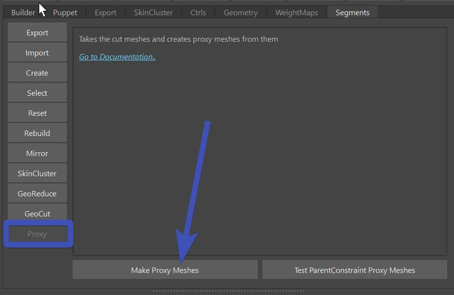    

But then constraining those the joints is a python thing at this point. But you can copy/paste this python script
as a start:  
``` python
@builderTools.addToBuild(iOrder=4)
def proxys():
    import kangarooTabTools.segments as segments
    segments.parentProxyMeshes()

    sMaster = utils.getMasterName()
    cmds.parent('_proxys', sMaster)

    sProxysAttr = nodes.addAttr(sMaster, ln='proxys', at='enum', en='OFF:ON:BOTH', k=True)
    nodes.createConditionNode(sProxysAttr, '!=', 0, True, False, sTarget='_proxys.v')

    sModelChildren = cmds.listRelatives('model', c=True, typ='transform') or []
    nodes.createConditionNode(sProxysAttr, '!=', 1, True, False, sTarget=['%s.v' % sT for sT in sModelChildren])

    cmds.setAttr('_proxys.overrideEnabled', 1)
    cmds.setAttr('_proxys.overrideDisplayType', 2)

```


## Reset Planes


## Rebuild


